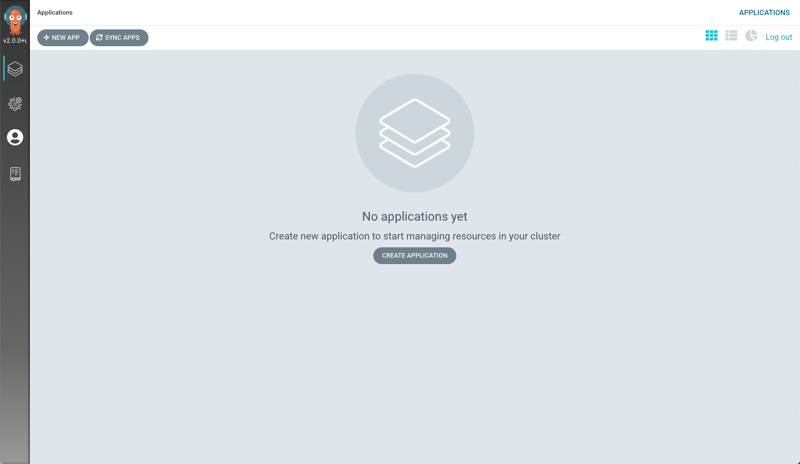
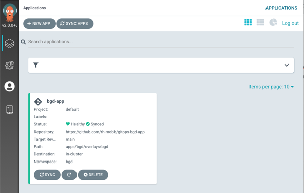
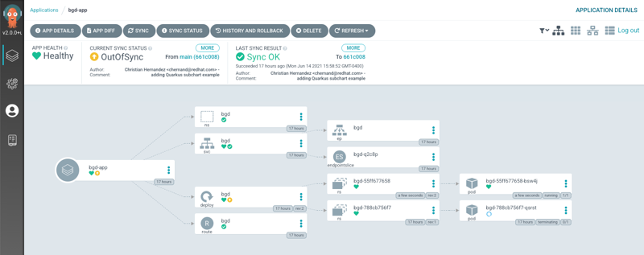
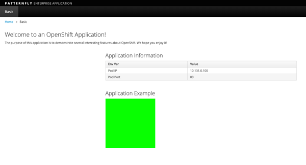

Author: [Steve Mirman](https://twitter.com/stevemirman)

## Video Walkthrough

If you prefer a more visual medium, you can watch [Steve Mirman](https://twitter.com/stevemirman) walk through this quickstart on [YouTube](https://www.youtube.com/watch?v=Gi18iemF1yI).

<iframe width="560" height="315" src="https://www.youtube.com/embed/Gi18iemF1yI" title="YouTube video player" frameborder="0" allow="accelerometer; autoplay; clipboard-write; encrypted-media; gyroscope; picture-in-picture" allowfullscreen></iframe>

<hr>

The purpose of this document is to help you get  OpenShift GitOps running in your cluster, including deploying a sample application and demonstrating how ArgoCD ensures environment consistency.

>This demo assumes you have a Managed OpenShift Cluster available and cluster-admin rights.
<hr>

### GitHub resources referenced in the demo:

- BGD Application: [gitops-bgd-app](https://github.com/rh-mobb/gitops-bgd-app) <br>
- OpenShift / ArgoCD configuration:  [gitops-demo](https://github.com/rh-mobb/gitops-demo)

### Required command line (CLI) tools

- GitHub: [git](https://git-scm.com/download/)
- OpenShift: [oc](https://docs.openshift.com/container-platform/4.2/cli_reference/openshift_cli/getting-started-cli.html#cli-installing-cli_cli-developer-commands)
- ArgoCD: [argocd](https://argoproj.github.io/argo-cd/cli_installation/)
- Kustomize: [kam](https://kubectl.docs.kubernetes.io/installation/kustomize/)

<hr>

## Environment Set Up

### Install the OpenShift GitOps operator

1. Install the **OpenShift GitOps** operator from the **Operator Hub**

    

### Pull files from GitHub

1. Clone the `gitops-demo` GitHub repository to your local machine
    ```
    git clone https://github.com/rh-mobb/gitops-demo gitops
    ```

2. Export your local path to the GitHub files
    ```
    export GITOPS_HOME="$(pwd)/gitops"
    cd $GITOPS_HOME
    ```

### Log in to OpenShift via the CLI

1. Retrieve the login command from the OpenShift console <br>
    

2. Enter the command in your terminal to authenticate with the OpenShift CLI (oc)
    >Output should appear similar to:
    ```
    Logged into "https://<YOUR-INSTANCE>.openshiftapps.com:6443" as "<YOUR-ID>" using the token provided.
    ```
<hr>

## Deploy the ArgoCD Project

### Create a new OpenShift project

1. Create a new OpenShift project called *gitops*
    ```
    oc new-project gitops
    ```

### Edit service account permissions

1. Add **cluster-admin** rights to the `openshift-gitops-argocd-application-controller` service account in the **openshift-gitops** namespace
    ```
    oc adm policy add-cluster-role-to-user cluster-admin -z openshift-gitops-argocd-application-controller -n openshift-gitops
    ```

### Log in to ArgoCD

1. Retrieve ArgoCD URL:
    ```
    argoURL=$(oc get route openshift-gitops-server -n openshift-gitops -o jsonpath='{.spec.host}{"\n"}')
    echo $argoURL
    ```

2. Retrieve ArgoCD Password:
    ```
    argoPass=$(oc get secret/openshift-gitops-cluster -n openshift-gitops -o jsonpath='{.data.admin\.password}' | base64 -d)
    echo $argoPass
    ```

3. In a browser, navigate to the ArgoCD console using the `$argoURL` value returned above <br>
    

4. Log in with the user name **admin** and the password returned as `$argoPass` above <br>
    

    >Optional step if you prefer CLI access
Login to the CLI:
    ```
    argocd login --insecure --grpc-web $argoURL  --username admin --password $argoPass
    ```

### Deploy the ArgoCD project

1. Use `kubectl` to apply the `bgd-app.yaml` file
    ```
    kubectl apply -f documentation/modules/ROOT/examples/bgd-app/bgd-app.yaml
    ```
    >The bgd-app.yaml file defines several things, including the repo location for the `gitops-bgd-app` application<br>
    

2. Check the rollout running the following command:
    ```
    kubectl rollout status deploy/bgd -n bgd
    ```

3. Once the rollout is **complete** get the route to the application
    ```
    oc get route bgd -n bgd -o jsonpath='{.spec.host}{"\n"}'
    ```

4. In your browser, paste the route to open the application <br>
    

5. Go back to your ArgoCD window and verify the configuration shows there as well <br>
    

6. Exploring the application in ArgoCD, you can see all the components are green (synchronized) <br>
    

### Deploy a change to the application

1. In the terminal, enter the following command which will introduce a chance into the bgd application
    ```
    kubectl -n bgd patch deploy/bgd --type='json' -p='[{"op": "replace", "path": "/spec/template/spec/containers/0/env/0/value", "value":"green"}]'
    ```

2. Go back to your ArgoCD window.  The application should no longer be synchronized <br>
    

3. Refresh the bgd application window and notice the change in box color<br>
    
    > The new deployment changed the box from blue to green, but only within OpenShift, not in the source code repository

### Synchronize the application

1. In the ArgoCD console, click the `SYNC` button to re-synchronize the bgd application with the approved configuration in the source code repository <br>
    

2. Refresh the bgd application window and notice the change in box color<br>
    

### Details from GitHub perspective
TBD


