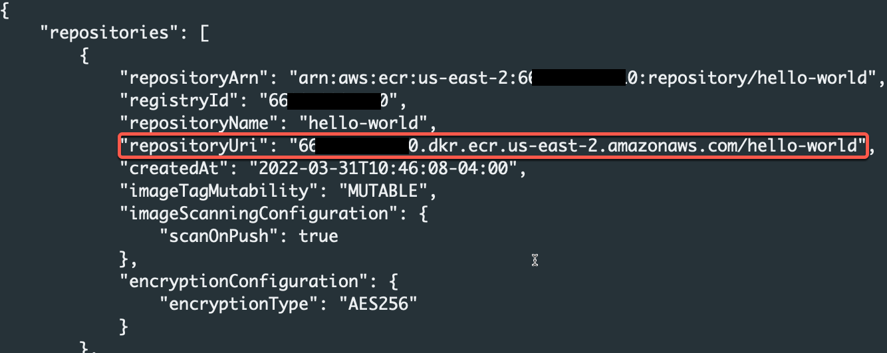

## Prerequisites

* [AWS CLI](https://docs.aws.amazon.com/cli/latest/userguide/install-cliv2.html)
* [Openshift CLI](https://mirror.openshift.com/pub/openshift-v4/clients/ocp/) 4.8+
* [Docker](https://docs.docker.com/get-docker/)

### Background
There are two options to use to authenticate wth Amazon ECR to pull images.

The traditional method is to create a pull secret for ecr.

Example:

```
oc create secret docker-registry ecr-pull-secret  \
  --docker-server=<registry id>.dkr.ecr.<region>.amazonaws.com  \
  --docker-username=AWS --docker-password=$(aws ecr get-login-password) \
  --namespace=hello-world
```

However Amazon ECR tokens expire every 12 hours which will mean you will need to re-authenticate every 12 hours either through scripting or do so manually.

A second, and preferred method, is to attach an ECR Policy to your cluster's worker machine profiles which this guide will walk you through.


### Attach ECR Policy Role

You can attach an ECR policy to your cluster giving the cluster permissions to pull images from your registries.  ROSA worker machine instances comes with pre-defined IAM roles, named differently depending on whether its a STS cluster or a non-STS cluster.

##### STS Cluster Role

`ManagedOpenShift-Worker-Role` is the IAM role attached to ROSA STS compute instances.

##### non-STS Cluster Role

`<cluster name>-<identifier>-worker-role` is the IAM role attached to ROSA non-STS compute instances.

> Tip: To find the non-STS cluster role run the following command with your cluster name:

```
aws iam list-roles | grep <cluster_name>
```


##### ECR Policies

ECR has several pre-defined policies that give permissions to interact with the service.  In the case of ROSA, we will be pulling images from ECR and will only need to add the `AmazonEC2ContainerRegistryReadOnly` policy.

1. Add the `AmazonEC2ContainerRegistryReadOnly` policy to the `ManagedOpenShift-Worker-Role` for STS clusters or the `<cluster name>-<identifier>-worker-role` for non-STS clusters.

   STS Example:

   ```
    aws iam attach-role-policy \
     --role-name ManagedOpenShift-Worker-Role \
     --policy-arn "arn:aws:iam::aws:policy/AmazonEC2ContainerRegistryReadOnly"
   ```

## Test it Out

1. Log into ECR

   ```
   aws ecr get-login-password --region region | docker login --username AWS \
     --password-stdin aws_account_id.dkr.ecr.region.amazonaws.com
   ```

2. Create a repository

   ```
   aws ecr create-repository \
    --repository-name hello-world \
    --image-scanning-configuration scanOnPush=true \
    --region region
   ```

3. Pull an image

   ```
   docker pull openshift/hello-openshift
   ```

4. Tag the image for ecr

   ```
   docker tag openshift/hello-openshift:latest <registry id>.dkr.ecr.<region>.amazonaws.com/hello-world:latest
   ```

   note: you can find the registry id and URI with the following command

   ```
   aws ecr describe-repositories
   ```

   <br/><br/>

5. Push the image to ECR

   ```
   docker push <registry id>.dkr.ecr.<region>.amazonaws.com/hello-world:latest
   ```

6. Create a new project

   ```
   oc new project hello-world
   ```

7. Create a new app using the image on ECR

   ```
   oc new-app --name hello-world --image <registry id>.dkr.ecr.<region>.amazonaws.com/hello-world:latest
   ```

8. View a list of pods in the namespace you created:

   ```
   oc get pods
   ```

   Expected output:

   

   If you see the hello-world pod running ... congratulations!  You can now pull images from your ECR repository.<br/><br/>

## Clean up

1. Simply delete the project you created to test pulling images:

    ```
    oc delete project hello-world
    ```

10. You may also want to remove the `arn:aws:iam::aws:policy/AmazonEC2ContainerRegistryReadOnly` policy from the worker nodes if you do no want them to continue to have access to the ECR.
